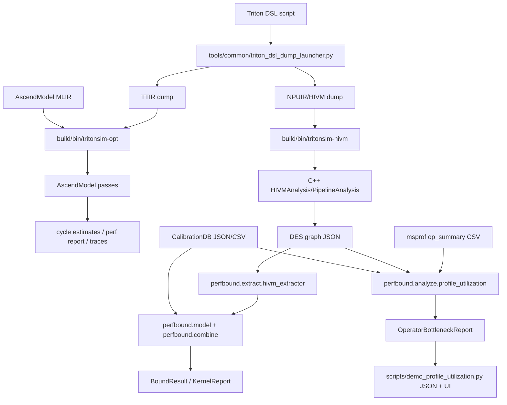
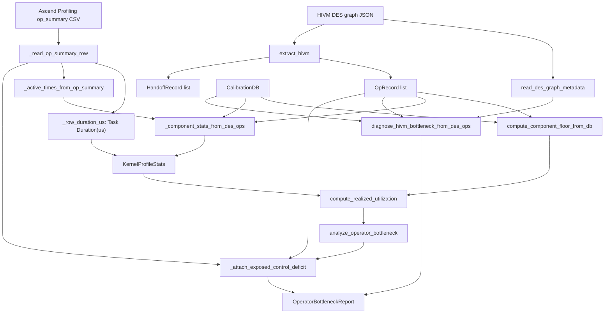

# Architecture

## Overall Architecture
The repository has two cooperating stacks:

- Native C++ MLIR stack: parses MLIR/HIVM inputs, runs AscendModel passes, schedules/analyzes operations, and emits reports/traces/DES graphs.
- Python `perfbound` stack: consumes structured extractor outputs, calibration, grid/profile data, and produces analytical bounds, validation reports, and profiling-utilization diagnoses.



## Major Modules and Responsibilities

### Native C++ Stack
- `include/AscendModel/IR/`, `lib/AscendModel/IR/`: AscendModel dialect declarations and implementation.
- `include/AscendModel/Transforms/`, `lib/AscendModel/Transforms/`: MLIR passes and pass pipeline registration.
- `include/AscendModel/Analysis/`, `lib/AscendModel/Analysis/`: hardware config, HIVM analysis, pipeline analysis, memory tiling optimizer, cost model, and bottleneck diagnosis.
- `tools/tritonsim-opt/`: mlir-opt-style entrypoint that registers MLIR, AscendModel, optional Triton, and optional BiShengIR dialects.
- `tools/tritonsim-hivm/`: direct HIVM/NPUIR analysis and optional Triton DSL dump workflow.
- `tools/hivm-crud/`: optional CLI wrapper around `HivmOpsEditor` when BiShengIR is available.

### Python `perfbound` Stack
- `perfbound/calibration/`: calibration dataclasses, loaders, microbench sources, and fitting scripts.
- `perfbound/extract/`: DSL/TTIR/HIVM extractors, operation classifier, eligibility oracle, and semantic extraction.
- `perfbound/model/`: pure analytical models: grid floor, component floor, serialization split, and bound pieces.
- `perfbound/combine/`: bound combiner, two-limit analysis, and report generation.
- `perfbound/validate/`: validation harness, msprof parsing, correctness checks, and counterfactual experiment support.
- `perfbound/analyze/`: profile utilization and HIVM bottleneck diagnosis on extracted/profiling data.
- `scripts/demo_profile_utilization.py`: demo-layer JSON conversion, report writing, and human-readable UI for profile utilization.

## Core Calling Relationships

### C++ MLIR Pipeline
`tools/tritonsim-opt/tritonsim-opt.cpp` registers dialects and `registerAllAscendModelPasses()`. `lib/AscendModel/Transforms/PassRegistration.cpp` registers `ascend-perf-model`:

```text
convert-triton-to-ascend
-> insert-data-transfers
-> assign-op-ids
-> estimate-cycles
-> analyze-pipeline
-> optional tiling optimization
-> perf-report
```

### HIVM / Profiling Bottleneck Pipeline

The fine-grained bottleneck workflow joins one modeled source and one measured
source:

- Modeled source: DES graph JSON emitted from HIVM analysis. It describes
  per-operation structure, pipe assignment, dependencies, model cycles, bytes,
  elements, optional flops, loop multiplier, memory spaces, repeat/mask, and
  schedule timestamps.
- Measured source: Ascend Profiling `op_summary` CSV. It provides real kernel
  elapsed time and component active-time counters.



The comparison flow is:

1. Classify each DES operation into a component through `PIPE_TO_COMPONENT` /
   `HW_UNIT_TO_COMPONENT`.
2. Aggregate theoretical work by component: compute components use operations
   or FLOPs depending on the model path; MTE components use bytes.
3. Load sustained reference rates from `CalibrationDB`: Cube/Vector rates in
   ops per microsecond and memory bandwidth in bytes per microsecond.
4. Compute the component floor as `T_core_floor = max_c(O_c / I_c)`.
5. Read measured elapsed time and component active time from `op_summary`.
6. Compute `A/I/U/R/E` per component and classify the operator-level
   bottleneck.
7. Attach HIVM model diagnosis and optional exposed control/sync deficit
   fields as diagnostic evidence.

`run_from_files(ignore_scalar=True)` creates a Compute/MTE-only diagnostic view:
DES operations classified as `Component.SCALAR` and the Scalar active-time
component are excluded from component/HIVM diagnosis. Measured kernel elapsed
time remains unchanged because component active times can overlap and therefore
cannot be subtracted from wall-clock duration. The option does not reschedule or
compact DES timestamps, so dependency gaps visible between remaining operations
are preserved.

### Kernel, Operator, Component Relationship

The code uses these levels in the profiling path:

- A kernel is the executable profiling unit selected from `op_summary`. The
  active row is selected by kernel-name substring when provided, then by maximum
  `Task Duration(us)` among candidates.
- An operator in `profile_utilization.py` is the same selected kernel-level
  profiling record for this analysis, not an individual DES operation.
- A DES operation is a modeled HIVM operation in `OpRecord`; many DES
  operations belong to one selected kernel/operator diagnosis.
- A component is the performance aggregation target: `cube`, `vector`,
  `scalar`, `mte_gm`, `mte_l1`, or `mte_ub`.

## Roofline Implementations

Two roofline-related implementations are present and should not be conflated:

- Native C++ report: `lib/AscendModel/Transforms/PerfReportPass.cpp` prints a
  traditional arithmetic-intensity roofline section using total FLOPs, total
  bytes, estimated time, peak Cube TFLOPS, and HBM bandwidth. It reports
  achieved TFLOPS, achieved GB/s, arithmetic intensity, ridge point, and a
  compute-bound versus memory-bound label.
- Python component model: `perfbound/model/component_model.py` implements the
  component roofline / Tier 2 bound. It computes per-component ideal rates with
  weighted harmonic means over precision or memory path and reports
  `T_core_floor = max_c(O_c/I_c)`.

## Data Flow
- Hardware config JSON is loaded in C++ analysis via `HardwareConfig.cpp` and in docs/config workflows via `configs/hardware_schema.json`.
- Calibration JSON is loaded in Python by `perfbound/calibration/calib_loader.py` into `CalibrationDB`.
- DES graph JSON is emitted by C++ HIVM analysis and loaded by `perfbound/extract/hivm_extractor.py`.
- op_summary CSV is parsed by `profile_utilization.py` for active-time evidence and by `validate/msprof_parser.py` for measured-time validation.

### Profiling Fields Used by `profile_utilization.py`

`profile_utilization.py` currently consumes these `op_summary` fields:

| Analysis value | `op_summary` field(s) | Unit |
| --- | --- | --- |
| Kernel/operator name | `Op Name`, `op_name`, or `Name` | string |
| Elapsed wall time | `Task Duration(us)`, `duration(us)`, `Duration(us)`, or `duration_us` | microseconds |
| Cube active time | `aic_mac_time(us)` | microseconds |
| Vector active time | `aiv_vec_time(us)` | microseconds |
| Scalar active time | `aic_scalar_time(us) + aiv_scalar_time(us)` | microseconds |
| MTE L1 active time | `aic_mte1_time(us)` | microseconds |
| MTE GM active time | `aic_mte2_time(us) + aiv_mte2_time(us)` | microseconds |
| MTE UB active time | `aic_fixpipe_time(us) + aiv_mte3_time(us)` | microseconds |
| Exposed control measured ratio | `aiv_scalar_time(us) / aiv_time(us)` | dimensionless ratio |

Missing, empty, `N/A`, or unparsable numeric cells are converted to `0.0` by
`_float_cell`. Rows whose duration parses to zero are not selected unless all
candidate rows do so.

## Important Entrypoints
- Native:
  - `build/bin/tritonsim-opt`
  - `build/bin/tritonsim-hivm`
  - optional `build/bin/hivm-crud`
  - optional `build/bin/ascend-tiling-opt`
- Python:
  - `perfbound.combine.run_report`
  - `perfbound.analyze.profile_utilization.run_from_files`
  - `scripts/demo_profile_utilization.py`
  - `scripts/run_profile_utilization_cases.sh`
  - `perfbound.validate.harness`

## Configuration Loading
- CMake derives or accepts `MLIR_DIR`, `LLVM_DIR`, `TRITON_SRC_DIR`, `TRITON_BUILD_DIR`, `TRITONSIM_BISHENGIR_SRC_DIR`, and `TRITONSIM_BISHENGIR_BUILD_DIR`.
- `configs/*.json` define hardware architecture-level parameters for C++ modeling.
- `perfbound/calibration/data/calib_910b3_v1.json` is the default calibration DB for Python modeling.
- `scripts/demo_profile_utilization.py` selects a single demo data source through `ACTIVE_CASE`.

## Error Handling
Observed patterns:

- Python parsers generally raise `ValueError`, `FileNotFoundError`, `subprocess.CalledProcessError`, or return warnings in report objects.
- `profile_utilization.py` stores component and HIVM warnings in report objects rather than printing directly.
- CLI tools use LLVM command-line parsing and emit diagnostics to stderr/stdout.
- Some hardware-dependent tests use xfail/skips when local hardware or toolchain support is unavailable.

## Key Extension Points
- Add hardware configs under `configs/` and keep schema/docs updated.
- Add calibration constants through `perfbound/calibration/data/` with provenance and tests.
- Add new MLIR passes through `include/AscendModel/Transforms/Passes.td`, `lib/AscendModel/Transforms/`, and `PassRegistration.cpp`.
- Extend HIVM/DES extraction in `perfbound/extract/hivm_extractor.py`.
- Extend profile diagnostics in `perfbound/analyze/profile_utilization.py` and update `docs/perfbound/profile_utilization/`.
- Add new validation cases under `tests/perfbound/` and fixtures under `tests/perfbound/fixtures/`.
